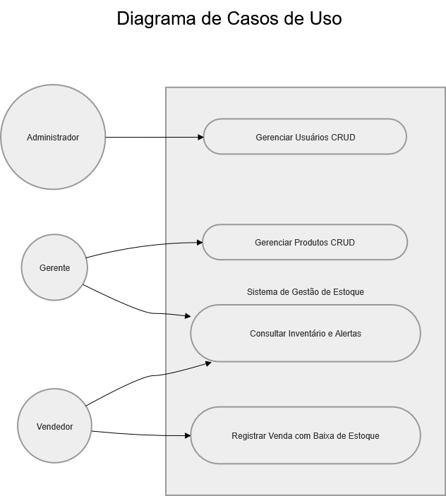
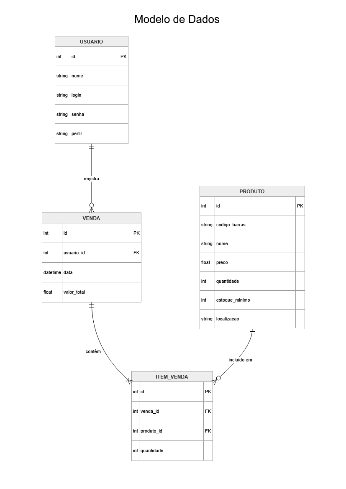
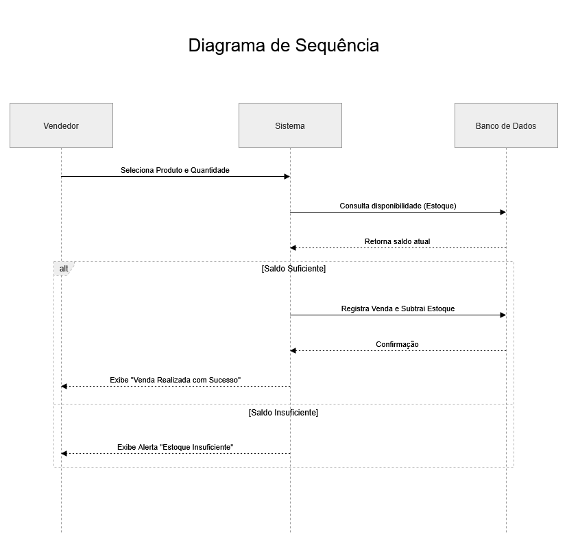

# Sprint 3 - Modelagem do Sistema

## 1. Objetivo
Representar a solução por meio de modelos que auxiliem a compreensão do sistema e apoiem as decisões de desenvolvimento, traduzindo os requisitos elicitados na sprint anterior para diagramas técnicos simplificado.

## 2. Modelos Produzidos

### 2.1 Diagrama de Casos de Uso
Este modelo representa as interações dos atores com as funcionalidades do sistema.

### 2.2 Modelo de Dados
Representação das entidades e relacionamentos necessários para a persistência dos dados.

### 2.3 Diagrama de Sequência
Detalhamento do fluxo de registro de venda e atualização automática de estoque.

## 3. Relação com os Requisitos (Rastreabilidade)
Para garantir que a modelagem atende às regras de negócio definidas na Sprint 2, os diagramas foram vinculados aos seguintes requisitos:

* **Diagrama de Casos de Uso (RF01, RF03, RF04, RF05, RF06 e RF07):** Demonstra visualmente as permissões de cada perfil. Ele justifica a associação ao mostrar que apenas os atores corretos (Admin, Gerente ou Vendedor) podem disparar as funções de gestão, consulta com filtros e o processo de venda.
* **Modelo de Dados (RF01, RF02, RF03, RF04 e RF06):** Define a estrutura de armazenamento permanente. Ele se associa a esses requisitos pois as tabelas `USUARIO`, `PRODUTO` e `VENDA` contêm os campos necessários para realizar o login, controlar as quantidades em estoque (incluindo o alerta de mínimo) e manter o histórico financeiro.
* **Diagrama de Sequência (RF04 e RF05):** Ilustra o comportamento lógico do sistema. Ele explica o passo a passo de como o software valida a disponibilidade do item no banco de dados antes de autorizar a transação, garantindo que a baixa de estoque e o bloqueio de vendas sem saldo funcionem conforme o planejado.

## 4. Revisão da Sprint
* **O que foi feito:** Modelagem estrutural e comportamental.
* **Decisões:** Foco em um modelo de dados simplificado para agilizar a futura programação.
* **Próximos passos:** Iniciar a configuração do ambiente de desenvolvimento.
