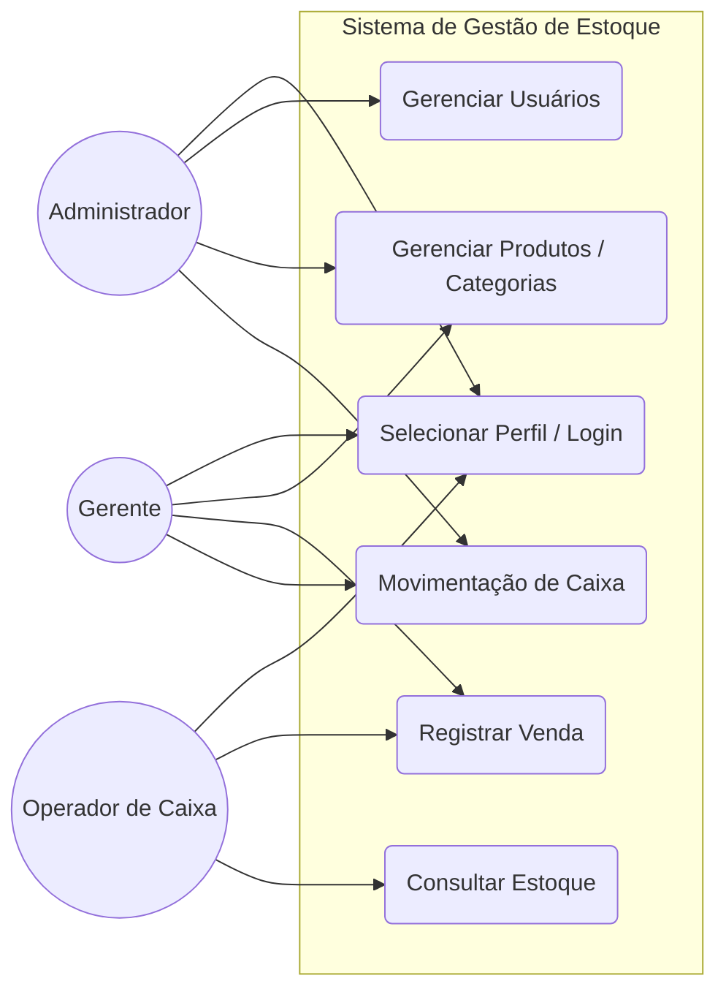
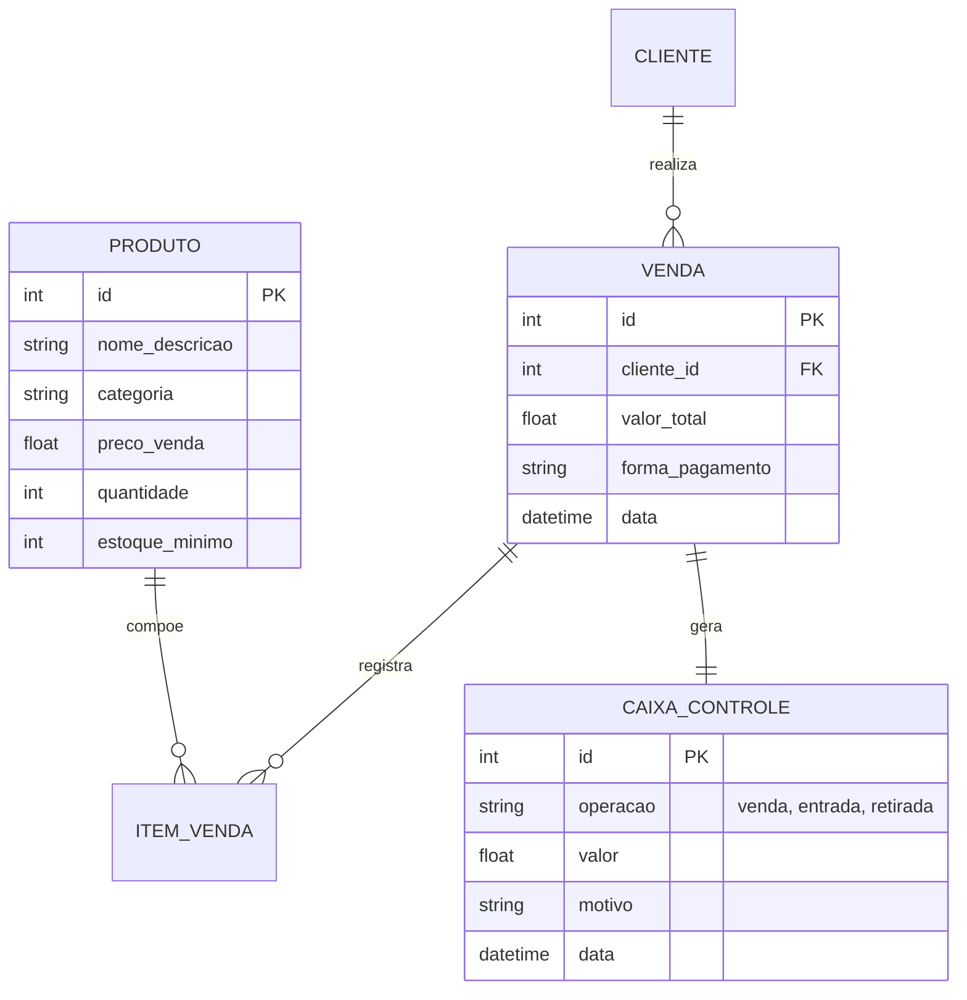
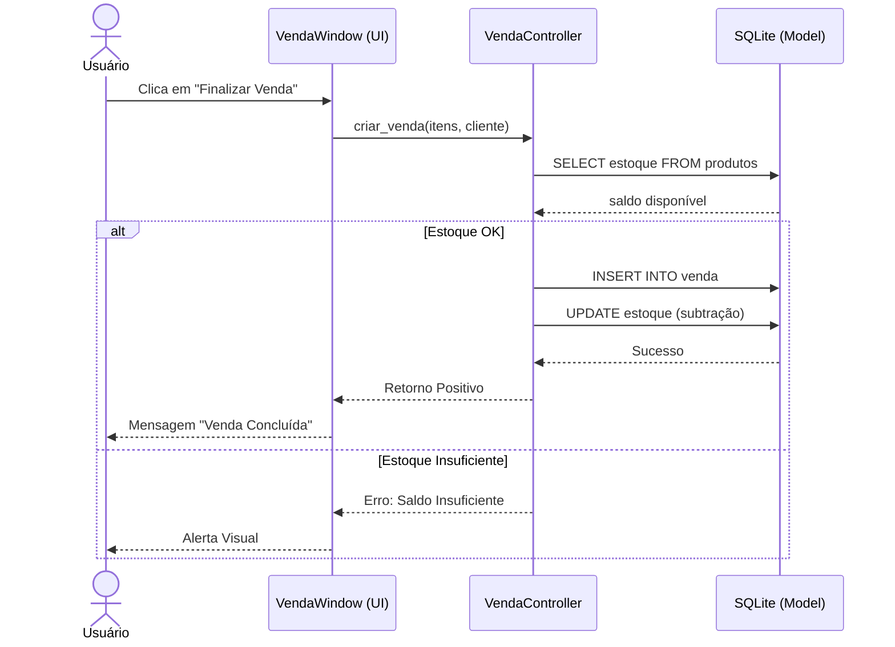

# Sprint 3 - Modelagem do Sistema

## 1. Objetivo
Representar a solução por meio de modelos que auxiliem a compreensão do sistema e apoiem as decisões de desenvolvimento, traduzindo os requisitos elicitados na sprint anterior para diagramas técnicos simplificados, focados na arquitetura Desktop MVC.

## 2. Modelos Produzidos

### 2.1 Diagrama de Casos de Uso
Este modelo representa as interações dos atores (Admin, Gerente e Operador) com as funcionalidades do sistema, destacando a fronteira de permissões.

```mermaid
graph LR
    %% Atores
    Admin((Administrador))
    Gerente((Gerente))
    Operador((Operador de Caixa))

    subgraph "Sistema de Gestão de Estoque"
        UC1(Selecionar Perfil / Login)
        UC2(Gerenciar Usuários)
        UC3(Gerenciar Produtos / Categorias)
        UC4(Registrar Venda)
        UC5(Consultar Estoque)
        UC6(Movimentação de Caixa)
    end

    Admin --> UC1
    Gerente --> UC1
    Operador --> UC1

    Admin --> UC2
    Admin --> UC3
    Admin --> UC6

    Gerente --> UC3
    Gerente --> UC4
    Gerente --> UC6

    Operador --> UC4
    Operador --> UC5
```

### 2.2 Modelo de Dados
Representação das tabelas necessárias para a persistência em SQLite.

```mermaid
erDiagram
    PRODUTO ||--o{ ITEM_VENDA : "compoe"
    VENDA ||--o{ ITEM_VENDA : "registra"
    CLIENTE ||--o{ VENDA : "realiza"
    VENDA ||--|| CAIXA_CONTROLE : "gera"

    PRODUTO {
        int id PK
        string nome_descricao
        string categoria
        float preco_venda
        int quantidade
        int estoque_minimo
    }

    VENDA {
        int id PK
        int cliente_id FK
        float valor_total
        string forma_pagamento
        datetime data
    }

    CAIXA_CONTROLE {
        int id PK
        string operacao "venda, entrada, retirada"
        float valor
        string motivo
        datetime data
    }
```

### 2.3 Diagrama de Sequência
Detalhamento do fluxo de registro de venda, demonstrando a interação entre a View (Interface), o Controller (Lógica) e o Model (Banco de Dados).

```mermaid
sequenceDiagram
    actor U as Usuário
    participant V as VendaWindow (UI)
    participant C as VendaController
    participant DB as SQLite (Model)

    U->>V: Clica em "Finalizar Venda"
    V->>C: criar_venda(itens, cliente)
    
    C->>DB: SELECT estoque FROM produtos
    DB-->>C: saldo disponível
    
    alt Estoque OK
        C->>DB: INSERT INTO venda
        C->>DB: UPDATE estoque (subtração)
        DB-->>C: Sucesso
        C-->>V: Retorno Positivo
        V-->>U: Mensagem "Venda Concluída"
    else Estoque Insuficiente
        C-->>V: Erro: Saldo Insuficiente
        V-->>U: Alerta Visual
    end
```

## 3. Relação com os Requisitos (Rastreabilidade)
Para garantir que a modelagem atende às regras de negócio definidas na Sprint 2, os diagramas foram vinculados aos seguintes requisitos:

* **Diagrama de Casos de Uso (RF01, RF02 e RF07):** Justifica o controle de acesso por perfil. Demonstra que a interface deve ser renderizada dinamicamente para que o Operador de Caixa acesse apenas funções de PDV e consulta.
* **Modelo de Dados (RF03, RF04 e RF06):** Define a estrutura de tabelas como PRODUTO (estoque), VENDA (histórico) e CAIXA_CONTROLE (movimentações manuais), garantindo que os dados financeiros estejam centralizados.
* **Diagrama de Sequência (RF04 e RF05):** Ilustra o comportamento lógico do VendaController. Ele explica o passo a passo da validação de saldo antes de autorizar o COMMIT no banco de dados, garantindo que a baixa de estoque ocorra apenas em transações bem-sucedidas.

## 4. Revisão da Sprint
* **O que foi feito:** Modelagem estrutural e comportamental utilizando notação visual simplificada.
* **Decisões:** Adoção de um modelo de dados relacional (SQLite) e arquitetura de componentes que facilite a aplicação futura do padrão Singleton para conexões.
* **Próximos passos:** Iniciar a configuração do ambiente de desenvolvimento.
