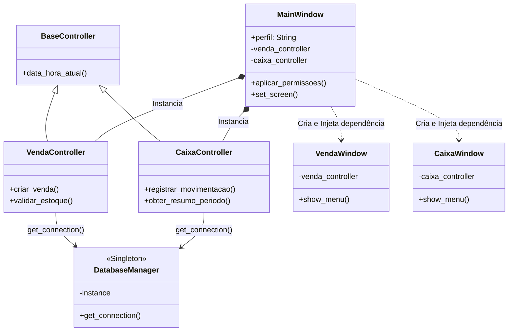

# Sprint 5 – Aplicação de Padrões de Projeto

## 1. Objetivo
O objetivo desta sprint é planejar e definir os padrões de projeto (Design Patterns) que deverão ser implementados no sistema de gestão de estoque. A aplicação destes padrões visa resolver problemas comuns de arquitetura antes da fase de codificação pesada, garantindo que o código final seja organizado, fácil de manter e otimizado para o ambiente Desktop.

## 2. Análise de Problemas e Seleção de Padrões
No escopo de um sistema de Ponto de Venda (PDV) local, identificamos três desafios técnicos que devem ser prevenidos por meio de padrões consolidados:

1.  **Múltiplas conexões bloqueando o banco:** Como usaremos o SQLite (banco em arquivo local), abrir conexões simultâneas a cada ação do usuário pode causar o erro "Database Locked", além de lentidão severa.
2.  **Acoplamento entre Tela e Banco de Dados:** Se os botões da interface executarem comandos SQL diretamente, qualquer mudança no banco de dados exigirá redesenhar a tela inteira (alto acoplamento).
3.  **Gerenciamento da Injeção de Dependências:** As telas filhas (ex: Tela de Venda) precisarão acessar as regras de negócio sem precisarem instanciar novos controladores a cada vez que o usuário navegar pelo menu.

## 3. Descrição e Justificativa dos Padrões Adotados

### 3.1. Singleton (Padrão Criacional)
* **Onde será aplicado:** Na classe de gerenciamento do banco de dados (`DatabaseManager`).
* **Justificativa:** O Singleton garante que apenas uma única instância da conexão com o SQLite seja criada e compartilhada por toda a aplicação durante o seu ciclo de vida.
* **Benefícios esperados:** Prevenção de corrupção de dados, otimização do consumo de RAM e eliminação de conflitos de concorrência ao salvar vendas e movimentações de caixa simultaneamente.

### 3.2. MVC - Model-View-Controller (Padrão Arquitetural)
* **Onde será aplicado:** Na estrutura global de diretórios e classes do projeto (separação em pastas `ui/`, `controller/`, `db/`).
* **Justificativa:** O MVC isola completamente a Interface Gráfica (View - Tkinter) das Regras de Negócio (Controller) e do Acesso a Dados (Model).
* **Benefícios esperados:** Permite que a equipe programe a lógica matemática (ex: cálculo de troco) sem risco de quebrar a interface visual. Garante alta coesão e baixo acoplamento.

### 3.3. Injeção de Dependência (Padrão Estrutural)
* **Onde será aplicado:** Na navegação entre a janela principal (`MainWindow`) e as janelas modulares (`CaixaWindow`, `VendaWindow`, etc.).
* **Justificativa:** Em vez de cada janela instanciar seus próprios controladores, a `MainWindow` criará os controladores uma única vez no início do programa e os "injetará" nas telas filhas por meio de seus construtores (`__init__`).
* **Benefícios esperados:** Evita o processamento desnecessário, facilita a criação de testes automatizados no futuro e mantém o "estado" do sistema fluido.

## 4. Representação e Atualização de Modelos
A arquitetura planejada nesta sprint altera o Diagrama de Classes do sistema. O modelo agora inclui os controladores atuando como mediadores e a classe de Banco de Dados possuindo o estereótipo `<<Singleton>>` como ponto único de acesso ao Modelo.

## 5. Registro de Acompanhamento da Sprint
Durante esta etapa de modelagem técnica, a equipe realizou as seguintes atividades:
* Levantamento dos riscos arquiteturais inerentes ao desenvolvimento Desktop nativo.
* Seleção e justificativa teórica dos padrões Singleton, MVC e Injeção de Dependência para o ambiente Python.
* **Decisões:** O código das próximas sprints deverá obrigatoriamente seguir a separação rigorosa de pastas para respeitar o padrão MVC planejado.
* **Próximos passos:** Consolidar a visão arquitetural no documento geral (Sprint 6) e iniciar a codificação estrutural baseada nestes diagramas.
