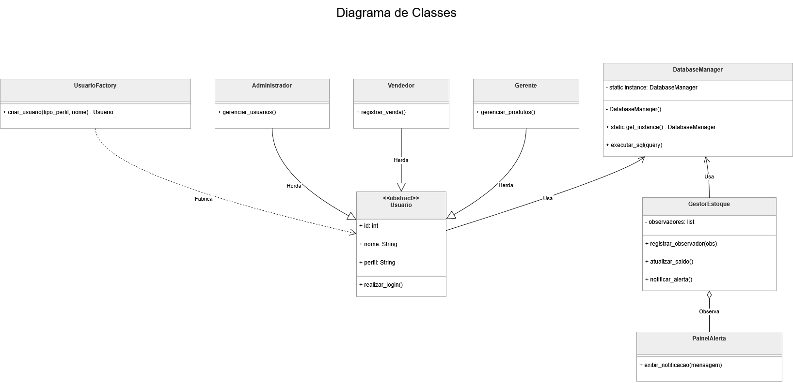

# Sprint 5 – Aplicação de Padrões de Projeto

## 1. Identificação
* **Número da sprint:** 05
* **Período:** 04/05/2026 a 09/05/2026
* **Data da entrega:** 09/05/2026

## 2. Objetivo
O objetivo desta sprint é identificar problemas comuns no desenvolvimento do sistema de gestão de estoque e aplicar padrões de projeto (Design Patterns) para garantir que o código seja organizado, fácil de manter e siga as melhores práticas da Engenharia de Software.

## 3. Análise de Problemas e Seleção de Padrões
Identificamos três desafios técnicos no projeto que podem ser resolvidos com padrões consolidados:

1.  **Instâncias duplicadas de conexão:** Abrir uma conexão com o banco de dados a cada clique do usuário consome recursos desnecessários e pode travar o sistema.
2.  **Criação complexa de perfis:** O sistema possui diferentes tipos de usuários (Admin, Gerente, Vendedor) com permissões distintas. Criar esses objetos manualmente em várias partes do código geraria repetição.
3.  **Monitoramento passivo de estoque:** O sistema precisa alertar quando um produto atinge o nível mínimo. Sem um padrão adequado, teríamos que "perguntar" ao banco o tempo todo se o estoque acabou, o que é ineficiente.

## 4. Descrição e Justificativa dos Padrões Adotados

### 4.1. Singleton (Padrão Criacional)
* **Onde se aplica:** Gerenciamento da conexão com o banco de dados SQLite.
* **Justificativa:** No Python, o Singleton garante que apenas uma instância do gerenciador de banco de dados exista. Isso centraliza o acesso ao arquivo de banco de dados, evitando conflitos de escrita e economizando memória do servidor.
* **Benefícios:** Performance otimizada e garantia de que todos os módulos do sistema utilizam a mesma conexão ativa.

### 4.2. Factory Method (Padrão Criacional)
* **Onde se aplica:** Criação das classes de Usuários e Perfis de Acesso.
* **Justificativa:** Através de uma "Fábrica de Usuários", o sistema decide qual classe instanciar (Vendedor, Gerente ou Admin) com base nos dados do banco, sem que a interface precise conhecer os detalhes internos de cada classe.
* **Benefícios:** Facilita a adição de novos tipos de usuários no futuro e centraliza a lógica de permissões em um único lugar (Alta Coesão).

### 4.3. Observer (Padrão Comportamental)
* **Onde se aplica:** Sistema de Alertas de Estoque Baixo (RF06).
* **Justificativa:** A classe que gerencia o estoque atua como o "Sujeito" que notifica os "Observadores" (módulo de alerta visual na tela) sempre que ocorre uma venda que deixa o saldo abaixo do mínimo.
* **Benefícios:** O sistema torna-se reativo. A lógica de venda não precisa "saber" como o alerta funciona; ela apenas notifica que houve uma mudança, mantendo o Baixo Acoplamento.

## 5. Representação e Atualização de Modelos
A aplicação desses padrões altera a estrutura técnica do projeto da seguinte forma:

* **Diagrama de Classes:** Inclusão de uma classe `DatabaseManager` com método de instância única e uma classe `UserFactory` para gerenciar perfis.
* **Diagrama de Sequência:** O processo de venda agora inclui um passo para "Notificar Observadores" logo após a atualização do saldo no banco de dados.

### 5.1. Diagrama de Classes Atualizado
Abaixo está o diagrama atualizado contemplando a arquitetura do sistema com os padrões de projeto incorporados:

**Resumo Técnico da Modelagem:**
* **Singleton (`DatabaseManager`):** Centraliza a persistência em uma instância única para otimizar o uso do SQLite.
* **Factory Method (`UsuarioFactory`):** Desacopla a criação de instâncias de `Administrador`, `Gerente` e `Vendedor`.
* **Observer (`GestorEstoque` e `PainelAlerta`):** Implementa a reatividade para notificações automáticas de estoque baixo.

## 6. Registro de Acompanhamento da Sprint
Durante esta etapa, a equipe realizou as seguintes atividades:
* Mapeamento de gargalos técnicos no fluxo de vendas e login.
* Seleção dos padrões Singleton, Factory e Observer como soluções ideais para o ambiente Python/Flask.
* Documentação das justificativas técnicas e dos benefícios esperados para a manutenção do software.
* Revisão do backlog para garantir que os padrões atendem aos requisitos funcionais (RF04, RF05 e RF06).
