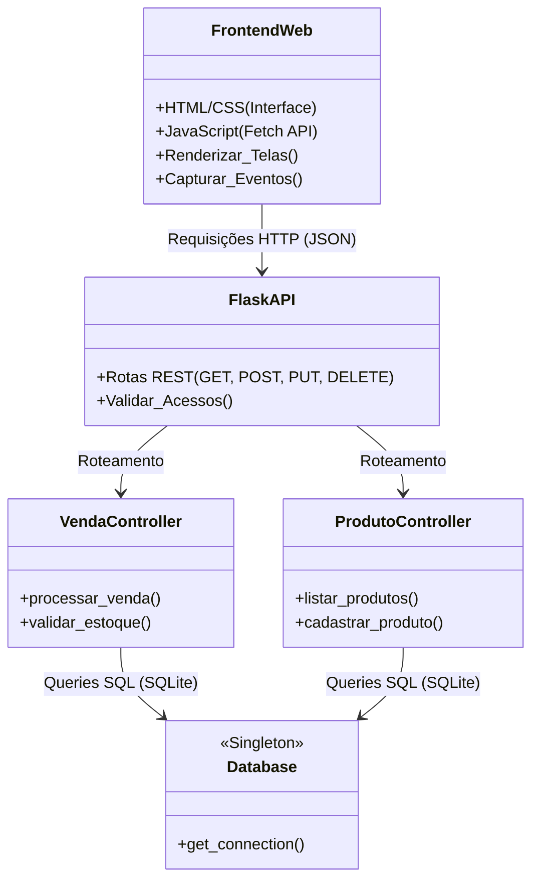

# Sprint 6 – Definição da Arquitetura de Software

## 1. Identificação
* **Número da sprint:** 06
* **Período:** 11/05/2026 a 16/05/2026
* **Data da entrega:** 16/05/2026

## 2. Objetivo da Sprint
Definir a arquitetura oficial da solução, explicitando seus componentes, responsabilidades, fluxos de comunicação e organização estrutural. O foco é consolidar uma arquitetura Web baseada em Client-Server, utilizando uma API REST no Backend e uma interface independente no Frontend, garantindo facilidade de hospedagem em servidores em nuvem.

## 3. Visão Arquitetural
A solução foi estruturada no modelo **Client-Server com comunicação via API RESTful**. Essa separação garante que a interface do usuário (Navegador) seja completamente independente da lógica de processamento e do banco de dados (Servidor).

## 4. Definição de Camadas e Componentes

### 4.1. Camada de Apresentação (Frontend)
* **Responsabilidade:** Interface com o usuário, captura de dados via formulários e exibição de alertas visuais.
* **Componentes:** Telas desenvolvidas em HTML/CSS e scripts em JavaScript puro (Vanilla JS) que realizam requisições `fetch()` para a API.

### 4.2. Camada de Controle e Lógica (Backend / API REST)
* **Responsabilidade:** Processamento das regras de negócio, controle de segurança (autenticação por perfil) e intermediação de dados.
* **Componentes:** Desenvolvido em **Python com Flask**. Possui Controladores modulares que aplicam as regras (ex: impedir venda sem estoque antes de acionar o banco de dados).

### 4.3. Camada de Modelo (Persistência)
* **Responsabilidade:** Gerenciamento da persistência e integridade dos dados permanentemente.
* **Componentes:** Motor de banco de dados **SQLite** operado de forma centralizada para evitar conflitos de leitura/escrita.

## 5. Justificativa das Escolhas Arquiteturais
* **Simplicidade e Custos:** A escolha do Flask com SQLite permite que a aplicação seja leve o suficiente para ser hospedada em plataformas de nuvem gratuitas ou de baixo custo. O Frontend, sendo estático (HTML/JS), também possui hospedagem facilitada.
* **Baixo Acoplamento:** A comunicação padronizada via JSON (API REST) garante que alterações no design da tela HTML não quebrem a lógica matemática do servidor Python, e vice-versa.
* **Segurança Centralizada:** O controle de acesso por perfil (Admin, Gerente, Operador) é validado no servidor (Backend), impedindo que usuários burlem o sistema apenas inspecionando o HTML.

## 6. Relação com a Qualidade Esperada
A estrutura modular (Frontend separado do Backend) atende diretamente aos requisitos **RNF06 e RNF07** do Backlog. Essa arquitetura facilita a manutenibilidade e torna o sistema escalável.

## 7. Registro da Sprint e Incremento
* **Incremento Produzido:** Definição da topologia de rede, estruturação do repositório separando fisicamente as pastas do Frontend e Backend, e documentação técnica da comunicação Client-Server.
* **O que ficou pendente:** Iniciar a codificação das rotas de API no Flask.
* **Próximos passos:** Planejar a estratégia e cenários de testes (Sprint 7) e iniciar o desenvolvimento do código-fonte mínimo.
