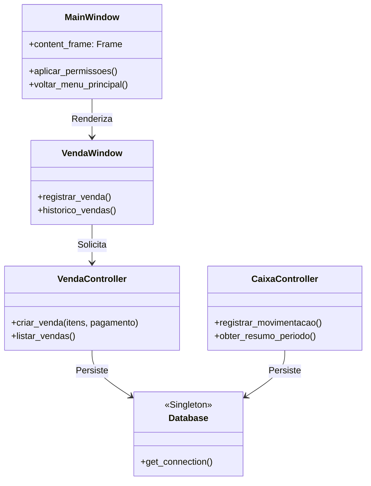

# Sprint 6 – Definição da Arquitetura de Software

## 1. Visão Arquitetural
A solução foi estruturada utilizando o padrão **MVC (Model-View-Controller)** adaptado para uma aplicação **Desktop Nativa**. A escolha por uma arquitetura local (Client-Side) visa atender aos requisitos de alta performance em PDVs (Pontos de Venda) e garantir a operação independente de latência de rede.

## 2. Definição de Camadas e Componentes

### 2.1. Camada de Visão (View)
* **Responsabilidade:** Interface com o usuário, captura de eventos e apresentação de dados.
* **Componentes:** Desenvolvidos em **Tkinter**. 
    * `LoginWindow`: Gerencia a entrada baseada em perfil.
    * `MainWindow`: Painel principal que renderiza dinamicamente as permissões.
    * `Windows Modulares`: Telas específicas para cada CRUD.

### 2.2. Camada de Controle (Controller)
* **Responsabilidade:** Processamento das regras de negócio e intermediação entre UI e Banco de Dados.
* **Componentes:** * `BaseController`: Fornece validações genéricas e utilitários.
    * `Módulos de Negócio`: Validam as operações (ex: impedir venda sem estoque).

### 2.3. Camada de Modelo (Model/Persistência)
* **Responsabilidade:** Gerenciamento da persistência e integridade dos dados.
* **Componentes:** * `DatabaseManager`: Implementa o padrão **Singleton** para garantir uma única conexão com o banco SQLite.
    * `SQLite3`: Motor de banco de dados relacional local.

## 3. Justificativa das Escolhas Arquiteturais
* **Baixa Latência:** Como o sistema lida com fluxo de caixa e estoque, a arquitetura desktop elimina o tempo de espera de requisições HTTP, tornando o registro de vendas instantâneo.
* **Segurança por Perfil:** A centralização da lógica de permissões na inicialização (Login) permite que o sistema oculte componentes de código da memória de acordo com o perfil (Admin, Gerente, Operador).
* **Portabilidade:** O uso de Python com Tkinter e SQLite permite que o sistema seja executado via executável (.exe) em qualquer ambiente Windows sem instalações complexas.

## 4. Relação com a Qualidade Esperada
A separação em camadas (SoC - Separation of Concerns) garante a **manutenibilidade**. Se for necessário trocar o banco de dados futuramente, apenas a camada Model será afetada, sem impacto na interface visual.

## 5. Registro da Sprint e Incremento
* **Incremento Produzido:** Implementação da tela de seleção de perfil e integração do Padrão Singleton no acesso ao banco.
* **Evidência:** O código atualizado no repositório demonstra o desacoplamento entre os arquivos da pasta `/ui` e `/controller`.
