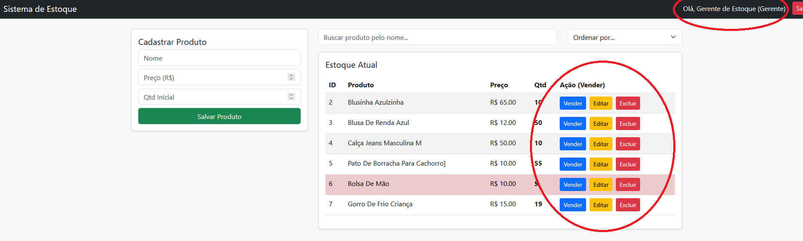
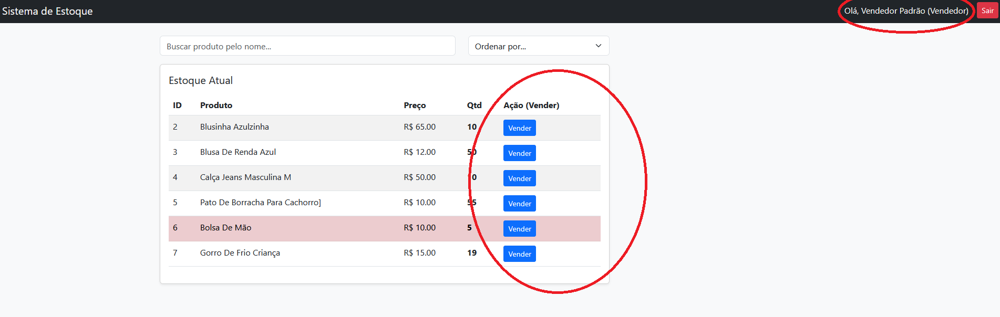
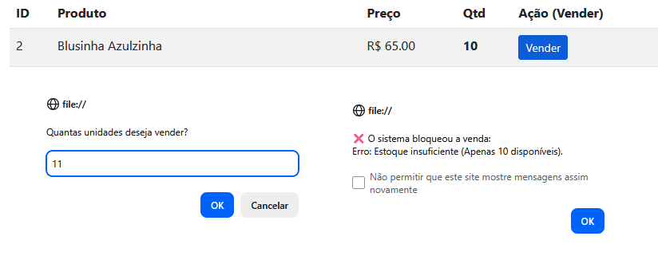
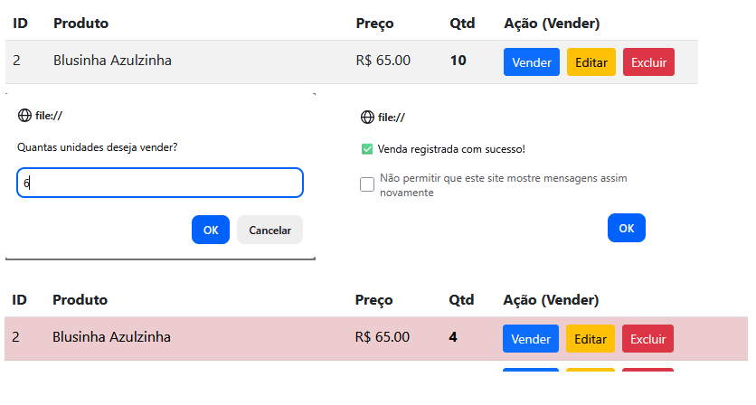
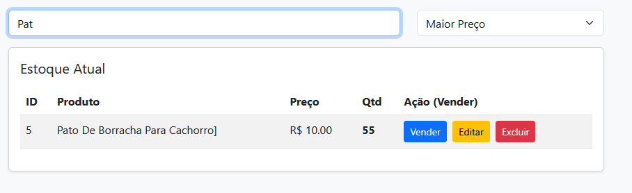
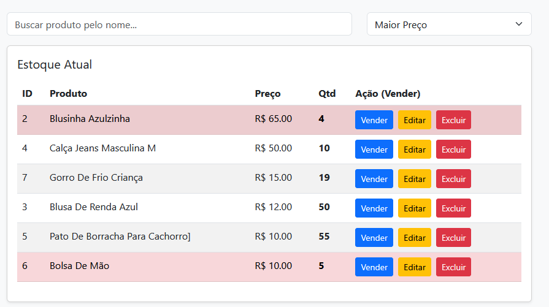
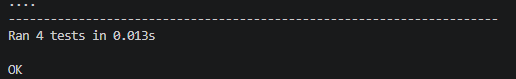

# Evidências de Testes

## 1. Testes Funcionais e de Regra de Negócio (Frontend)

**[CT01] Validação de Segurança por Perfil -> PASSOU**
O perfil "Gerente" possui acesso total ao CRUD, enquanto o perfil "Vendedor" sofre restrição, com a supressão automática dos botões de edição, exclusão e gestão administrativa.

**[CT02] Impedir Venda de Produto Sem Saldo -> PASSOU**
A tentativa de vender quantidade superior ao saldo foi barrada ativamente pelo backend, disparando um alerta.

**[CT03] Baixa Automática e Alerta de Estoque -> PASSOU**
A efetivação de uma venda subtraiu imediatamente o saldo e acionou o alerta visual (cor) para estoque <= 5.
  

**[CT04] Usabilidade (Busca e Ordenação Reativa) -> PASSOU**
Filtros funcionaram na memória do navegador isolando o produto e ordenando por preço.

## 2. Testes Unitários (Backend)
Scripts de testes automatizados (`unittest` do Python) garantiram a estabilidade da API contra dados inválidos (Bloqueio de venda sem saldo, bloqueio de cadastro com dados negativos, etc). Todos os 4 casos passaram.
